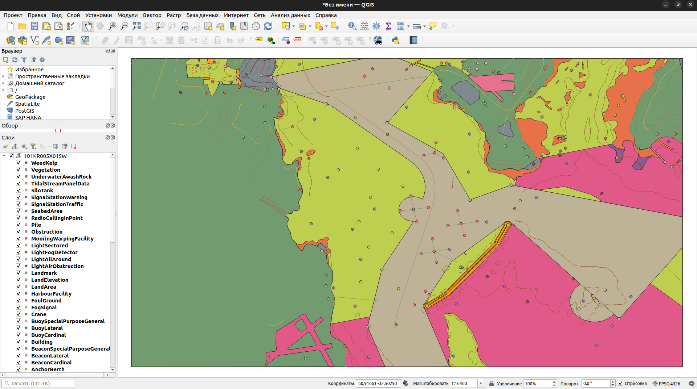

# ogrS101lazy

IHO S-101 (ENC) GDAL/OGR vector driver.

## Description

The **ogrS101lazy** project is a GDAL vector driver that enables working with Electronic Navigational Charts (ENC) in IHO S-101 format through the standard GDAL/OGR interface. The driver uses a "lazy" approach through GML conversation: when a S-101 file is first accessed, it is converted to GML format and cached (until original enc file modified), then the driver transfers control over the data to GML driver.

This driver is based on the [S101toGML](https://github.com/pandazz77/S101toGML) project, which provides S-101 to GML conversion capabilities.

## Dependencies

- **GDAL** >= 3.0
- **CMake** >= 3.10
- **C++17**
- **S101toGML** (submodule)

## Building

```bash
# update submodules
git submodule update --init --recursive

# Create build directory
mkdir build
cd build

# Configure project with CMake
cmake ..

# Build
cmake --build . -j 8 --config Release --target S101Lazy
```

## Installing
```bash
# install after 'Building'
sudo cmake --install ./build --component S101Lazy # will install ogr driver to /usr/lib/gdalplugins

# or install release version via wget:
sudo wget -P /usr/lib/gdalplugins/ https://github.com/pandazz77/OGRS101Lazy/releases/download/v1.0/ogr_S101Lazy.so
```

## Usage

After installation, the driver is automatically registered with GDAL and becomes available for use with all GDAL tools.

Checkout driver availability:
```bash
❯ ogrinfo --formats
Output:
Supported Formats:
 S101Lazy -vector- (rov): IHO S-101 lazy driver (using gml)
 ...
```

Get info about .000 file:
```bash
❯ ogrinfo ./S101toGML/S101toGML/File/101KR005X01SW.000
INFO: Open of `./S101toGML/S101toGML/File/101KR005X01SW.000'
      using driver `S101Lazy' successful.
1: NauticalInformation (None)
2: NavigationalSystemOfMarks (Polygon)
3: DataCoverage (Polygon)
4: LocalDirectionOfBuoyage (Polygon)
5: QualityOfBathymetricData (Polygon)
6: Building
7: Road (Line String)
8: BeaconSpecialPurposeGeneral (Point)
9: SeabedArea
10: LandArea
11: ShorelineConstruction
12: DepthContour (Line String)
13: LandElevation
14: DepthArea (Polygon)
15: FoulGround
16: SlopeTopline (Line String)
17: Landmark (Point)
18: AnchorageArea (Polygon)
19: BuiltUpArea (Polygon)
20: LightAllAround (Point)
21: HarbourFacility (Point)
22: CableSubmarine (Line String)
23: MooringWarpingFacility (Point)
24: Coastline (Line String)
25: DredgedArea (Polygon)
26: RecommendedTrack (Line String)
27: DockArea (Polygon)
28: Vegetation
29: Sounding (None)
30: SiloTank (Point)
31: SignalStationTraffic (Point)
32: WeedKelp (Point)
33: SignalStationWarning (Point)
34: NavigationLine (Line String)
35: FerryRoute (Line String)
36: FortifiedStructure (Polygon)
37: BeaconLateral (Point)
38: Gate (Polygon)
39: LightFogDetector (Point)
40: LightAirObstruction (Point)
41: TidalStreamPanelData (Point)
42: LandRegion (Polygon)
43: SeaAreaNamedWaterArea (Polygon)
44: RadioCallingInPoint (Point)
45: BuoySpecialPurposeGeneral (Point)
46: AnchorBerth (Point)
47: LockBasin (Polygon)
48: FogSignal (Point)
49: LightSectored (Point)
50: PipelineSubmarineOnLand (Line String)
51: Crane (Point)
52: Railway (Line String)
53: River (Line String)
54: Runway (Polygon)
55: AirportAirfield (Polygon)
56: RestrictedAreaRegulatory (Polygon)
57: RestrictedAreaNavigational (Polygon)
58: Fairway (Polygon)
59: MagneticVariation (Polygon)
60: AdministrationArea (Polygon)
61: HarbourAreaAdministrative (Polygon)
62: UnderwaterAwashRock (Point)
63: Obstruction
64: Wreck (Polygon)
65: Pile (Point)
66: BuoyCardinal (Point)
67: BuoyLateral (Point)
68: BeaconCardinal (Point)
69: MooringTrot (None)
70: RangeSystem (None)
```

Import .000 files to QGIS:


## Integration

The driver is installed in the GDAL plugins directory (`/usr/lib/gdalplugins` on Linux), allowing it to be used automatically without additional configuration.
